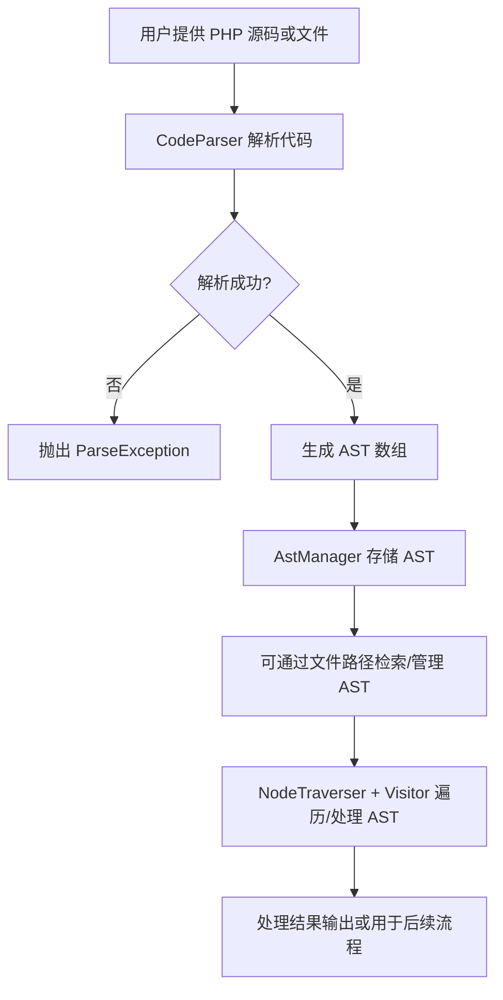

# PHP Packer AST 工作流程（Mermaid）

```mermaid
flowchart TD
    A[用户提供 PHP 源码或文件] --> B[CodeParser 解析代码]
    B --> C{解析成功?}
    C -- 否 --> E[抛出 ParseException]
    C -- 是 --> D[生成 AST 数组]
    D --> F[AstManager 存储 AST]
    F --> G[可通过文件路径检索/管理 AST]
    G --> H[NodeTraverser + Visitor 遍历/处理 AST]
    H --> I[处理结果输出或用于后续流程]
```

> 本流程图描述了 PHP Packer AST 的核心使用流程，包括代码解析、AST 管理、访问者遍历等主要环节。
